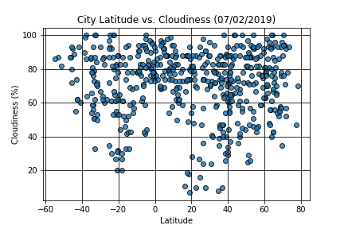
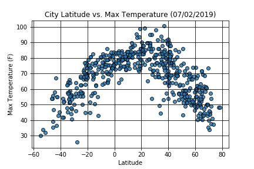
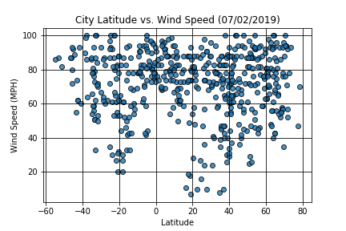

# Latitude vs Weather

As you can see from the above photo there does not seem to be a discernable trend regarding latitude and cloudiness. 
If we were to draw a regression line that line would look more or less straight than showing any positive or negative correlation. 

As you can see there does not seem to be a discernable trend regarding latitude and humidity. 
If we were to draw a regression line that line would look more or less straight than showing any positive or negative correlation. 

As expected, the weather becomes significantly warmer as we get closer to the equator (0 Deg. Latitude) 
What is even more interesting is that the temperature reaches its peak warmth around a Latitude of 40, meaning it was hottest in the Northern Hemisphere.
This may be due to the tilt of the earth at the time that this data was collected.

As you can see there does not seem to be a discernable trend regarding latitude and windspeed. 
If we were to draw a regression line that line would look more or less straight than showing any positive or negative correlation. 
